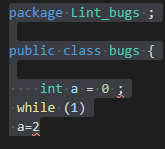
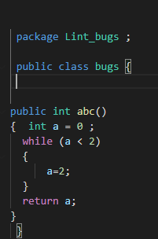

# Linters for java microverse capstone project
-Created a linter check project for java programming language (Java is a powerful general-purpose programming language. It is used to develop desktop and mobile applications, big data processing, embedded systems, and so on.
-There should be a semicolon after every expression.
- code inside a class or method should be enclosed in braces.
)using ruby programming language

## Built With

- Ruby
- GIT
- VSCODE
- RSPEC


## Prerequisites
- VSCODE
- Github profile
- Git and Ruby
- Rspec.
- Ruboco
- Visual studio code ruby exentions
- visual studio code java extentions
<h1>How to install ruby </h1>
- Type www.rubyinstaller.org in your browser

- Download Ruby 2.6.6 version

- Install it following the instructions 
<h6>Operating system Used</h6>
- Windows 10 pro operating system 
- But it can also run Linux operating sysytems
<h6>System specifications </h6>
- 8 GB RAM
- Hardisk 1TB
- 64 bit operating system


<h1>Getting Started</h1>

#To get a local copy up and running follow these simple example steps.

In command line editor
```ruby
cd <folder>

git clone  https://github.com/Lidya1234/Linters
cd Linters 
cd bin
```
## How to run
ruby main.rb 
Then it will test the file for linter errors


## JAVA LINTER
- Check_trailing_spaces
- check_semicolon
- check_tags
- check_empty_lines in methods and classes

## TESTING EXAMPLE
- Bad code



- Good code




## How to run tests
- cd 
- In command line editor write gem install rspec .
- You will find the enumerables_spec.rb in Linters/spec folder .
- To run it  in command line editor write  rspec spec/linter_spec.rb .


<h2>Authors</h2>

👤 Author1

- Github: [@Lidya-github ](https://github.com/Lidya1234)
- Twitter: [@Lidya-twitter](https://twitter.com/Lidya42676629)
- Linkedin: [Lidya-linkedin-link](https://www.linkedin.com/in/lidya-ghebreigziabher-4a94391aa/)


## 🤝 Contributing

 Contributions, issues and feature requests are welcome!

Feel free to check the issues page.

Show your support Give a ⭐️ if you like this project!

## Acknowledgments
Inspired by Microverse.

## 📝 License 
This project does not have a license

